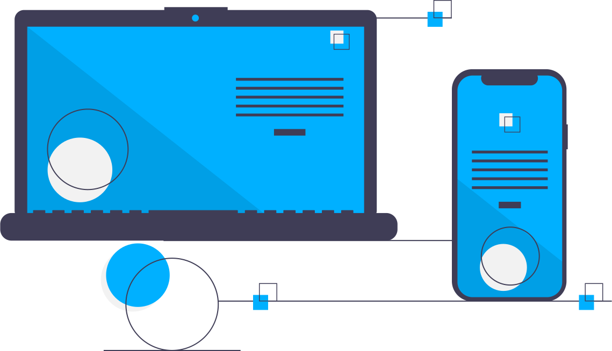

  
  
  ### Hi there, I'm Kartikey Gupta 👋

  <!-- Add more content here -->

 
 

  

  

  As an enthusiastic tech geek I am constantly trying to learn and follow the best software development practices to develop a particular project .Being
a dedicated problem solver and web developer, I am driven by the challenge of finding innovative solutions and creating aesthetically pleasing
websites. I thrive in dynamic environments that encourage growth, and I am always eager to explore and learn new technologies to stay ahead of
the curve.
 

 

<!-- 

  
<!--  -->
## Fun Fact 🎈:

<!--  -->

- 🔭 I’m currently Looking for Software Development Opportunities
- 👯 I’m looking to collaborate with other web developers
- 🏍  Ask me about Automobiles
- 🥅 2024 Goals: To Be Better the Best Version of Myself
- ⚡ Fun fact: I love to play basketball and enjoy reading books
- 📫 How to reach me: https://github.com/kartik-raj7

 
 

# 📊 GitHub Stats:
<table>
    <tr>
        <td>
            
        </td>
        <td>
            
        </td>
    </tr>
</table>

## 🌏 **CONNECT WITH ME**

 

## 🌏 **COMPETITIVE PROGRAMMING**

## 🕸️ **WEB DEV**

[][repo]
[][repo]
[][repo]
[][repo]
[][repo]
[][repo]
[][repo]
[][repo]
[][repo]
[][repo]
[][repo]
[][repo]

## 📱 **MOBILE DEV**

[][repo]

## ⚙️ **BACKEND DEV**

[][repo]
[][repo]
[][repo]
[][repo]

## 📅 **DATABASES**

[][repo]

## 🎯 **PROGRAMMING LANGUAGES**

[][repo]
[][repo]
[][repo] 

## 🛠️ **DEVOPS TOOLS**

[][repo]
[][repo]

## ☁️ **CLOUDS**

[][repo]
[][repo]
[][repo]
[][repo]
[][repo]

## 📄 **CODE EDITOR & IDES**

[][repo]
[][repo]
[][repo]

## ☃️ **MY LEARNING RESOURCES**

[][sof]
[][medium]
[][mdn]
[][doc]
[][fcc]
[][gog]
[][udemy]
[][quora]
[][google]

[medium]: https://medium.com/
[github]: https://github.com/
[google]: https://www.google.com
[mdn]: https://developer.mozilla.org/en-US/
[wiki]: https://en.wikipedia.org/wiki/Main_Page
[quora]: https://www.quora.com/
[doc]: https://www.digitalocean.com/community
[udemy]: https://www.udemy.com/
[gog]: https://www.geeksforgeeks.org/
[fcc]: https://www.freecodecamp.org/
[sof]: https://stackoverflow.com/
[repo]: https://github.com/codingstella?tab=repositories

 

[website]: https://github.com/kartik-raj7/home
[twitter]: https://twitter.com/Kartikey20Gupta/
[instagram]: https://www.instagram.com/kartik__raj7/
[linkedin]: https://www.linkedin.com/in/kartikey-gupta20/
